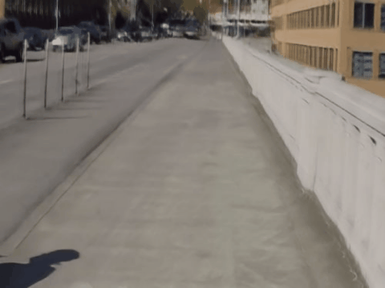
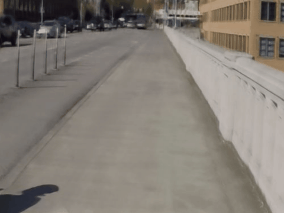
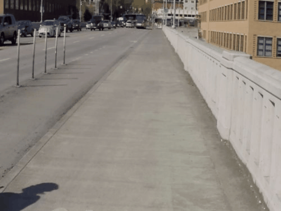

# Blur Interpolation Meets Maximum a Posterior Estimator with Local Gaussian Scale Mixture Prior (CVPR-1770)

##  Examples of the Demo (x8 Multi-Frame Interpolation) videos (240fps) interpolated from blurry videos (30fps)
<table>
<tr> <td>Dataset </td> <td>BiT </td> <td>Ours</td> <td>GT</td> </tr>
<tr> <td>Adobe240 </td> <td></td> <td></td> <td> </td> </tr>
<tr> <td>Real Blur Interpolation </td><td></td> <td></td> <td> </td> </tr>
</table>

* The 30fps blurry input frames are interpolated to be 240fps sharp frames. All results are encoded at 30fps to be played as x8 slow motion and spatially down-scaled due to the limit of file sizes. 

> **Abstract:**
>*This paper studies the challenging problem of recovering motion from blur, also known as joint deblurring and interpolation or blur interpolation (BI).
The challenges are twofolds. \textbf{(1)} Previous averaging degradation process do not accurately match real-world blurry. 
\textbf{(2)} Due to the complex real world blurry, it's hard to estimate an accurate optical flow for BI task.
Specifically, the optical flow of clear frames obeys a mostly Laplacian distribution, while the optical flow of blur frames obeys a complex distribution. How to bridge the gap between the Laplacian distribution and the complex distribution is crucial for accurate optical flow estimation.
To this end, we propose a new BI degradation model that incorporates the Gaussian noise and spatio-temporal modulation between adjacent frames.
Based on the degradation model, we propose a novel maximum a posterior (MAP) estimation framework to model the real world BI problem, named MAP-BINet.
To bridge the gap between the Laplacian distribution and complex real world distribution, we leverage the properties of the local Gaussian scale mixture (LGSM) as a prior term for accurate optical flow estimation.
The LGSM model contains a family of probabilistic distributions (e.g., Laplacian distribution and student’s t-distribution), when provided with an appropriate scale and mean.
MAP-BINet is experimented on the simulated Adobe240 dataset and the Real Blur Interpolation (RBI) dataset. 
The experimental results achieve better performance of existing SOTA methods.*

## When the paper accepted, the code will be release soon.

## Acknowledgements
Our work is based on [BIN](https://github.com/laomao0/BIN), [DeMFI](https://github.com/JihyongOh/DeMFI) and [BiT](https://github.com/zzh-tech/BiT) repositories. We thank the authors for releasing their code and dataset. 
