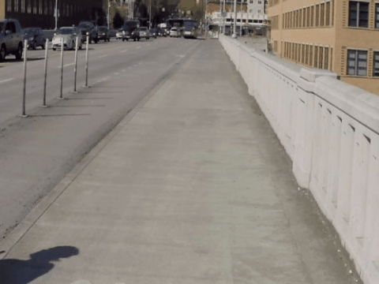
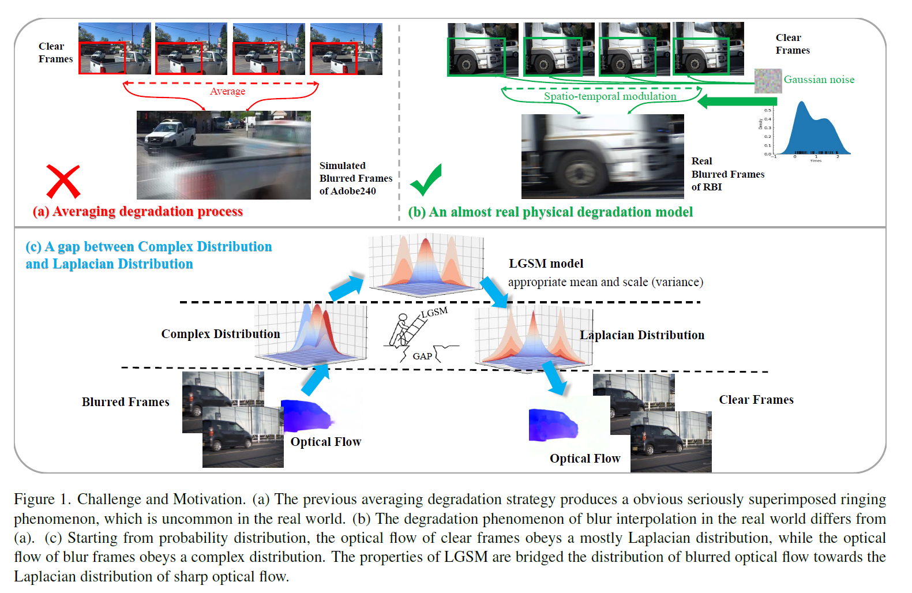

# Blur Interpolation Meets Maximum a Posterior Estimator with Local Gaussian Scale Mixture Prior (CVPR-1770)

##  连续差八帧的视频 (240fps)， 输入为模糊视频 (30fps)
<table>
<tr> <td>Dataset </td> <td>BiT </td> <td>Ours</td> <td>GT</td> </tr>
<tr> <td>Adobe240 </td> <td></td> <td></td> <td> </td> </tr>
<tr> <td>Real Blur Interpolation </td><td></td> <td></td> <td> </td> </tr>
</table>

* The 30fps blurry input frames are interpolated to be 240fps sharp frames. All results are encoded at 30fps to be played as x8 slow motion and spatially down-scaled due to the limit of file sizes. 

> **Abstract:**
>*主要挑战分为两个方面。1 之前方法中假设的视频退化模型在现实生活中十分少见。如图1（a）(b)所示。
2 由于视频模糊的影响，因此像FlowNet这些估计清晰视频光流的模型，在模糊视频中效果并不会很好。
更加详细的说，清晰视频的光流服从一个拉普拉斯分布。而模糊视频的光流服从一个未知的模糊分布。
如何将模糊光流变成清晰光流，是我们目前遇到的一个挑战。如图1（c）所示。
为了解决挑战1，我们提出了一个可能更加接近真实的模糊视频插帧的退化模型
根据提出的退化模型，我们提出了最大后验概率框架去建模，叫做MAP-BINet。
为了解决挑战2，我们使用了局部高斯尺度混合模型作为光流场的先验项。
由于局部高斯尺度混合模型是一种家族概率分布，当提供给它适当的尺度和均值时它能模拟出家族分布中的一种。
我们将该框架在仿真数据集Adobe240和真实数据集RBI上进行了实验和测试，分别得到了不错的实验效果。*

  

## When the paper accepted, the code will be release soon.

## Acknowledgements
Our work is based on [BIN](https://github.com/laomao0/BIN), [DeMFI](https://github.com/JihyongOh/DeMFI) and [BiT](https://github.com/zzh-tech/BiT) repositories. We thank the authors for releasing their code and dataset. 
