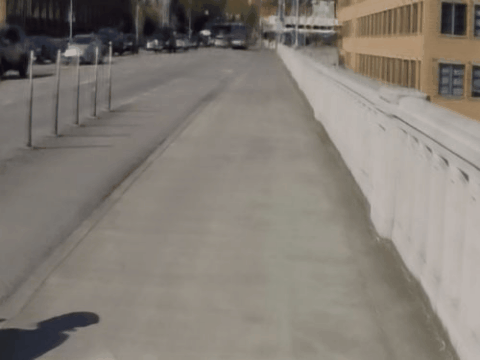

# Blur Interpolation Meets Maximum a Posterior Estimator with Local Gaussian Scale Mixture Prior (CVPR-1770)

##  MIF(240fps)， inputs(30fps)
<table>
<tr> <td>Dataset </td> <td>BiT </td> <td>Ours</td> <td>GT</td> </tr>
<tr> <td>Adobe240 </td> <td></td> <td></td> <td> </td> </tr>
<tr> <td>Real Blur Interpolation </td><td></td> <td></td> <td> </td> </tr>
</table>

* The 30fps blurry input frames are interpolated to be 240fps sharp frames. All results are encoded at 30fps to be played as x8 slow motion and spatially down-scaled due to the limit of file sizes. 

> **Abstract:**
>*주요 도전은 두 가지다.1 이전 방법에서 가정한 비디오 퇴화 모델은 현실에서는 거의 찾아볼 수 없습니다. 그림 1(a)(b)에서 보시다시피.
2 비디오의 흐림으로 인해, FlowNet과 같은 선명한 비디오 광류를 추정하는 모델은, 흐린 비디오에서는 그다지 잘 작동하지 않습니다.
더 자세히 말하자면, 선명한 비디오의 광류는 라플라시안 분포를 따릅니다. 반면 흐린 비디오의 광류는 알려지지 않은 흐림 분포를 따릅니다.
어떻게 흐린 광류를 선명한 광류로 바꾸는지는 현재 우리가 직면한 도전 과제 중 하나입니다. 그림 1(c)에서 보시다시피.
도전 과제 1을 해결하기 위해, 우리는 더 실제적인 흐린 비디오 프레임 삽입 퇴화 모델을 제시했습니다
제안된 퇴화 모델을 바탕으로, 우리는 최대사후확률 프레임워크를 사용하여 모델링하였다. 이를 MAP-BINet라고 합니다.
도전 과제 2를 해결하기 위해, 우리는 광류 필드의 사전 항으로 지역 가우시안 스케일 혼합 모델을 사용했습니다.
지역 가우시안 스케일 혼합 모델은 가족 확률 분포이므로, 적절한 스케일과 평균이 제공되면 가족분포 중 하나를 모방할 수 있습니다.
이 프레임워크를 모의 데이터셋인 Adobe240와 실제 데이터셋인 RBI에서 실험하고 테스트하였고, 각각 좋은 실험 결과를 얻었습니다.*

  

## When the paper accepted, the code will be release soon.

## Acknowledgements
Our work is based on [BIN](https://github.com/laomao0/BIN), [DeMFI](https://github.com/JihyongOh/DeMFI) and [BiT](https://github.com/zzh-tech/BiT) repositories. We thank the authors for releasing their code and dataset. 
